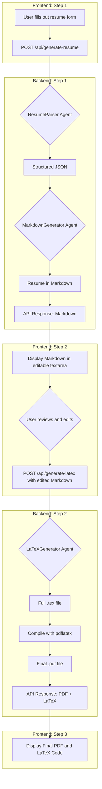

# Full-Stack Resume Builder

This is a full-stack web application designed to help you create a professional and polished resume with ease. It features a React-based frontend and a Python backend that handles resume data processing and generation using a multi-step, agent-driven process.

## System Flow

The application follows a two-stage generation process, allowing for user intervention and editing before the final output is created.



## ✨ Features

### Frontend
- **Interactive Form**: A user-friendly, multi-section form to input all your resume details.
- **Split-Screen Markdown Editor**: A responsive, split-screen view to edit raw Markdown on the left and see a live-rendered preview on the right.
- **Editable Markdown Preview**: After initial generation, review and edit your resume content in a clean Markdown format before final compilation.
- **Live PDF Previews**: See your final compiled PDF directly in the browser.
- **Multiple Export Options**: Download your resume as a PDF or get the raw LaTeX code.
- **Interactive Skill Selection**: Add technical skills quickly from a curated list of popular technologies or add your own custom skills.
- **Modern UI**: Built with Shadcn/UI and Tailwind CSS for a clean, modern, and responsive interface.

### Backend
- **Two-Stage RESTful API**: Endpoints to first generate a Markdown draft and then to compile the final documents from Markdown.
- **LaTeX Resume Generation**: Dynamically creates professional-looking resumes in `.tex` format from Markdown input.
- **PDF Conversion**: Converts the generated LaTeX resume into a downloadable PDF using a `pdflatex` engine.
- **Agentic Orchestration**: A multi-agent pipeline that uses Google's Gemini models to first parse raw user data into structured JSON, then convert that JSON into an editable Markdown document, and finally transform the Markdown into high-quality LaTeX code.

## 🛠️ Tech Stack

### Frontend
- **Framework**: [React](https://react.dev/)
- **Build Tool**: [Vite](https://vitejs.dev/)
- **Language**: [TypeScript](https://www.typescriptlang.org/)
- **UI Components**: [Shadcn/UI](https://ui.shadcn.com/)
- **Styling**: [Tailwind CSS](https://tailwindcss.com/)

### Backend
- **Language**: [Python](https://www.python.org/)
- **Framework**: [FastAPI](https://fastapi.tiangolo.com/)
- **Key Libraries**: `langchain`, `google-generativeai`, `uvicorn`

## 🚀 Getting Started

Follow these instructions to get a copy of the project up and running on your local machine.

### Prerequisites

- [Node.js](https://nodejs.org/en) (which includes npm) for the frontend.
- [Python 3.x](https://www.python.org/downloads/) for the backend.
- A LaTeX Distribution (e.g., [TeX Live](https://www.tug.org/texlive/), [MiKTeX](https://miktex.org/)) for PDF compilation.
    - **On macOS (via [MacPorts](https://www.macports.org/)):** `sudo port install texlive-latex`
    - **On Debian/Ubuntu:** `sudo apt-get install texlive-latex-base texlive-latex-extra texlive-fonts-recommended`
    - **On Arch Linux:** `sudo pacman -S texlive-core texlive-latexextra texlive-fontsextra texlive-langgreek`
    - **On Windows (via [MiKTeX](https://miktex.org/download)):** Download and run the installer.

### Installation & Setup

1.  **Clone the repository:**
    ```sh
    git clone https://github.com/your-username/your-repo-name.git
    cd your-repo-name
    ```

2.  **Set up the Frontend:**
    ```sh
    cd frontend
    npm install
    ```

3.  **Set up the Backend:**
    It is recommended to use a virtual environment for the Python dependencies.
    ```sh
    cd backend
    python -m venv venv
    source venv/bin/activate  # On Windows, use `venv\Scripts\activate`
    pip install -r requirements.txt
    ```

### Running the Application

1.  **Start the Backend Server:**
    From the `backend` directory, run:
    ```sh
    uvicorn main_api:app --reload
    ```

2.  **Start the Frontend Development Server:**
    In a new terminal, from the `frontend` directory, run:
    ```sh
    npm run dev
    ```
    The application will be available at `http://localhost:5173`. The frontend expects the backend to be running on `http://localhost:8000`.

---

_This project was bootstrapped with Vite and uses a number of open-source libraries. A big thanks to the creators and maintainers of those projects._
