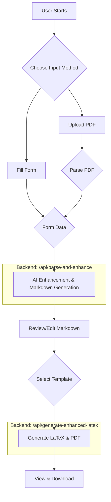

# Unified Resume Generation System

## Overview

This system provides a unified, AI-powered pipeline to generate professional LaTeX resumes from either user-filled forms or an uploaded PDF. It leverages Google's Gemini models to parse, enhance, and format resume content, offering multiple professional LaTeX templates.

The key goal of this unified system is to provide a single, consistent user experience and a maintainable codebase for all resume generation tasks.

## Architecture

The system is composed of two main parts: a Next.js frontend and a FastAPI backend.

### 1. **Frontend (`/frontend`)**
- A single-page application built with **Next.js** and **React**.
- Provides two primary user flows:
    1.  **Form-based**: Users fill out a detailed form with their resume information.
    2.  **PDF-based**: Users upload an existing PDF resume, which is then parsed and processed.
- **UI Components**: Built with `shadcn/ui` and styled with `Tailwind CSS`.
- **State Management**: Uses React's `useState` and `useEffect` for managing the application state through different stages.
- **Key libraries**: `framer-motion` for animations, `react-markdown` for live previews.

### 2. **Backend (`/backend`)**
- A **FastAPI** application serving the core logic.
- All API endpoints are now consolidated into `enhanced_main_api.py`.
- **Port**: `8000`
- **Key Endpoints**:
    - `POST /api/parse-and-enhance`:
        - Handles both JSON data from the form and PDF file uploads.
        - Parses the input to extract structured data.
        - Optionally enhances the content using an AI agent.
        - Returns structured JSON data and a generated Markdown string.
    - `POST /api/generate-enhanced-latex`:
        - Takes Markdown content and structured data.
        - Requires a `template_name` to select the desired LaTeX template.
        - Generates the final LaTeX code and compiles it into a PDF.
        - Returns the LaTeX string and a base64-encoded PDF.

## Data Flow Pipeline

The unified pipeline follows these steps:



## Key Components & Logic

### AI Agents (`/backend/latex_resume_generator/agents/`)

- **`ResumeParser`**: Extracts structured JSON from raw PDF text.
- **`ResumeEnhancer`**: The core AI component. It takes basic data and intelligently expands project descriptions, organizes skills into contextual categories, and refines professional summaries. Uses a higher temperature setting for creative output.
- **`EnhancedMarkdownGenerator`**: Converts the (potentially enhanced) structured JSON into a clean Markdown format.
- **`EnhancedLaTeXGenerator`**: The final step. It takes the Markdown content and a selected template to produce a complete, high-quality LaTeX document ready for compilation. It uses template-specific prompts for better results.

### LaTeX Templates (`/backend/latex_resume_generator/templates/`)

The system supports multiple professional templates:
- `jakes_resume` (Default)
- `deedy_resume`
- `curve_cv`
- `tibault_resume`

Each template has its own directory containing `.cls` (class), `.sty` (style), and `.tex` (template) files. The backend automatically copies the necessary dependencies to the output directory before compilation.

## How to Run

### 1. Start the Backend Server

Navigate to the project root and run:

```bash
# Set up virtual environment if you haven't already
python -m venv venv
source venv/bin/activate

# Install dependencies
pip install -r backend/requirements.txt

# Run the FastAPI server
uvicorn backend.enhanced_main_api:app --host 0.0.0.0 --port 8000 --reload
```

### 2. Start the Frontend Application

In a new terminal, navigate to the project root and run:

```bash
cd frontend
pnpm install
pnpm dev
```
The application will be available at `http://localhost:3000`.

### 3. Testing the PDF Pipeline
A test script is provided to verify the PDF-to-LaTeX flow.
1.  Place a test resume named `test_resume.pdf` in the project root.
2.  Run the script:
```bash
python test_pdf_integration.py
```
This will process the PDF through all available templates and save the output files in the `test_output/` directory.

## Deprecation of `/pdf to latex`

The functionality of the `/pdf to latex` directory has been fully integrated into the main `/frontend` and `/backend` applications. This separate directory is now considered deprecated and can be safely removed to simplify the codebase. 